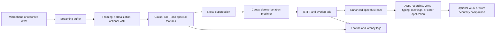

# System Design

## End-to-end workflow

## Module responsibilities

| Module | Responsibility | Current implementation |
|---|---|---|
| Audio I/O | Read and write PCM WAV data and preserve sample-rate metadata. | `realtime_speech_enhancement/audio.py` |
| Streaming controller | Maintain chunk state, frame boundaries, overlap, flush behavior, and output alignment. | `realtime_speech_enhancement/enhancer.py` |
| Spectral front end | Windowed one-sided STFT and inverse STFT reconstruction. | `realtime_speech_enhancement/stft.py` and streaming path in `enhancer.py` |
| Noise suppression | Estimate a noise power spectrum and apply a conservative smoothed gain. | `StreamingEnhancer._enhance_spectrum` |
| Dereverberation | Predict and subtract a delayed complex spectral component with bounded adaptation. | `StreamingEnhancer._enhance_spectrum` |
| Data generation | Create controlled room impulse responses and noisy/reverberant pairs. | `realtime_speech_enhancement/degradation.py` |
| Dataset metadata | Scan collected WAV files without loading all samples and write manifests. | `realtime_speech_enhancement/dataset.py` |
| Evaluation | Compute SNR, SI-SDR, improvement, processing time, RTF, and nominal frame latency. | `realtime_speech_enhancement/metrics.py` and `cli.py` |

## Data and control flow

The enhancement engine is stateful. Each input chunk is appended to a pending buffer. Once a complete frame is available, the current frame and permitted history are processed, one hop is emitted, and the state is retained for the next chunk. No future frame is used. The final flush pads only the final incomplete frame and then trims the output to the input length.

The evaluation layer is separate from the enhancement core. This allows denoising-only and joint denoising/dereverberation conditions to be compared without changing the audio I/O or metric logging code.

